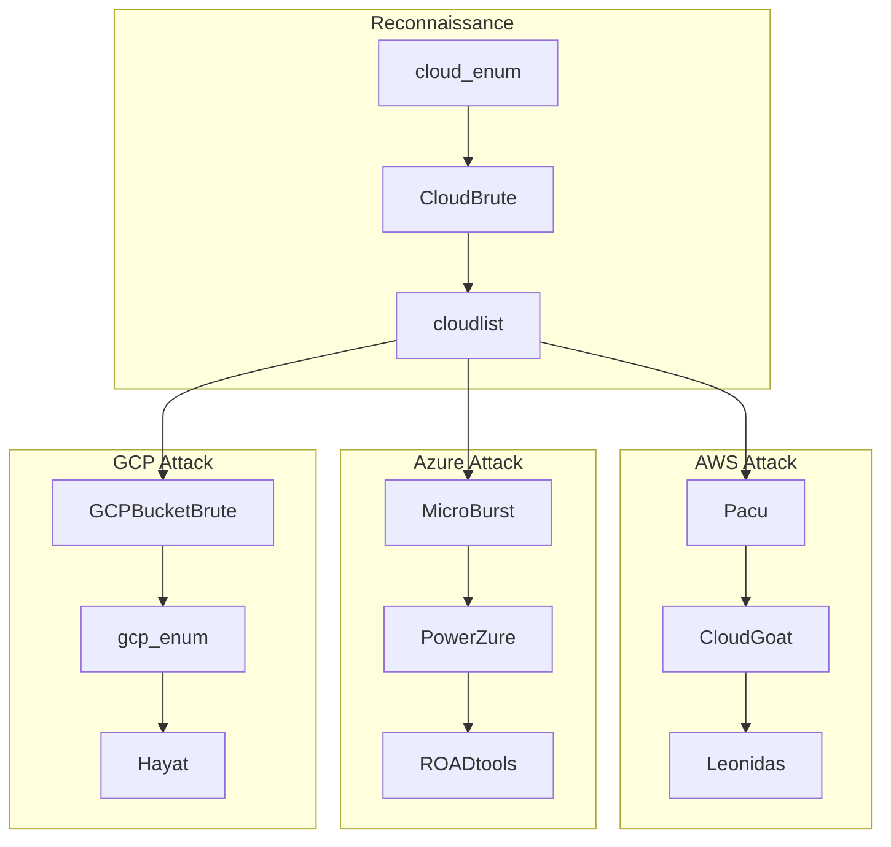

<div align="center">

# 🛡️ Awesome Cloud Security - Complete Review

[](https://github.com/vanhoangkha/cloud-security-review/stargazers)
[](https://opensource.org/licenses/MIT)
[](http://makeapullrequest.com)
[](https://awesome.re)

**Comprehensive review and analysis of cloud security tools for AWS, Azure, GCP & Multi-Cloud environments**

[Overview](#-overview) •
[Multi-Cloud Tools](#-multi-cloud-security-tools) •
[AWS](#-aws-security) •
[Azure](#-azure-security) •
[GCP](#-gcp-security) •
[Kubernetes](#-kubernetes--container-security) •
[Learning Path](#-learning-path)

</div>

---

## 📖 Overview

This repository provides an in-depth review of [NextSecurity/Awesome-Cloud-Security](https://github.com/NextSecurity/Awesome-Cloud-Security) with additional multi-cloud resources and tools.

### 🎯 Target Audience

| Role | Fit | Why |
|:-----|:---:|:----|
| Cloud Security Engineer | ⭐⭐⭐⭐⭐ | Comprehensive audit & compliance tools |
| Penetration Tester | ⭐⭐⭐⭐⭐ | Extensive offensive security toolkit |
| DevSecOps Engineer | ⭐⭐⭐⭐⭐ | IaC scanning & CI/CD integration |
| Security Architect | ⭐⭐⭐⭐⭐ | Multi-cloud architecture patterns |
| SRE/Platform Engineer | ⭐⭐⭐⭐ | Infrastructure security automation |

---

## 🌐 Multi-Cloud Security Tools

### Cross-Platform Security Assessment

| Tool | AWS | Azure | GCP | Description |
|:-----|:---:|:-----:|:---:|:------------|
| [ScoutSuite](https://github.com/nccgroup/ScoutSuite) | ✅ | ✅ | ✅ | Multi-cloud security auditing |
| [Prowler](https://github.com/prowler-cloud/prowler) | ✅ | ✅ | ✅ | Security best practices assessment |
| [CloudSploit](https://github.com/aquasecurity/cloudsploit) | ✅ | ✅ | ✅ | Cloud security configuration checks |
| [Steampipe](https://github.com/turbot/steampipe) | ✅ | ✅ | ✅ | SQL-based cloud queries |
| [CloudQuery](https://github.com/cloudquery/cloudquery) | ✅ | ✅ | ✅ | Cloud asset inventory |
| [Cartography](https://github.com/lyft/cartography) | ✅ | ✅ | ✅ | Infrastructure graph analysis |
| [Cloud Custodian](https://github.com/cloud-custodian/cloud-custodian) | ✅ | ✅ | ✅ | Rules engine for cloud governance |

### Infrastructure as Code (IaC) Security

| Tool | Terraform | CloudFormation | ARM | Pulumi | K8s | Description |
|:-----|:---------:|:--------------:|:---:|:------:|:---:|:------------|
| [Checkov](https://github.com/bridgecrewio/checkov) | ✅ | ✅ | ✅ | ✅ | ✅ | Static analysis for IaC |
| [tfsec](https://github.com/aquasecurity/tfsec) | ✅ | ❌ | ❌ | ❌ | ❌ | Terraform security scanner |
| [Terrascan](https://github.com/tenable/terrascan) | ✅ | ✅ | ✅ | ❌ | ✅ | Policy as code |
| [KICS](https://github.com/Checkmarx/kics) | ✅ | ✅ | ✅ | ✅ | ✅ | Find vulnerabilities in IaC |
| [Trivy](https://github.com/aquasecurity/trivy) | ✅ | ✅ | ❌ | ❌ | ✅ | Comprehensive security scanner |
| [Snyk IaC](https://snyk.io/product/infrastructure-as-code-security/) | ✅ | ✅ | ✅ | ✅ | ✅ | Developer-first IaC security |

### Multi-Cloud CSPM (Cloud Security Posture Management)

| Tool | Type | Features |
|:-----|:-----|:---------|
| [Prisma Cloud](https://www.paloaltonetworks.com/prisma/cloud) | Commercial | Full CSPM, CWPP, CIEM |
| [Wiz](https://www.wiz.io/) | Commercial | Agentless cloud security |
| [Orca Security](https://orca.security/) | Commercial | SideScanning technology |
| [Lacework](https://www.lacework.com/) | Commercial | Anomaly detection |
| [CloudGuard](https://www.checkpoint.com/cloudguard/) | Commercial | Unified cloud security |

### Multi-Cloud Penetration Testing



---

## 🟠 AWS Security

### Native Security Services

```
┌─────────────────────────────────────────────────────────────────┐
│                      AWS SECURITY STACK                          │
├─────────────────────────────────────────────────────────────────┤
│  IDENTITY & ACCESS MANAGEMENT                                    │
│  ├── IAM (Users, Roles, Policies)                               │
│  ├── IAM Identity Center (SSO)                                  │
│  ├── AWS Organizations (SCPs)                                   │
│  └── Resource Access Manager                                    │
├─────────────────────────────────────────────────────────────────┤
│  DETECTION & MONITORING                                          │
│  ├── GuardDuty (Threat Detection)                               │
│  ├── Inspector (Vulnerability Assessment)                        │
│  ├── Detective (Security Investigation)                          │
│  ├── CloudTrail (API Logging)                                   │
│  ├── Config (Configuration Compliance)                          │
│  └── Security Lake (Security Data Lake)                         │
├─────────────────────────────────────────────────────────────────┤
│  NETWORK SECURITY                                                │
│  ├── WAF (Web Application Firewall)                             │
│  ├── Shield (DDoS Protection)                                   │
│  ├── Network Firewall                                           │
│  ├── Firewall Manager                                           │
│  └── VPC (Security Groups, NACLs, Flow Logs)                   │
├─────────────────────────────────────────────────────────────────┤
│  DATA PROTECTION                                                 │
│  ├── KMS (Key Management)                                       │
│  ├── CloudHSM (Hardware Security Module)                        │
│  ├── Secrets Manager                                            │
│  ├── Certificate Manager                                        │
│  └── Macie (Data Discovery & Protection)                        │
├─────────────────────────────────────────────────────────────────┤
│  INTEGRATION & ORCHESTRATION                                     │
│  ├── Security Hub (Central Dashboard)                           │
│  └── Audit Manager (Compliance Automation)                      │
└─────────────────────────────────────────────────────────────────┘
```

### AWS Security Tools

| Category | Tool | Description |
|:---------|:-----|:------------|
| **Audit** | [Prowler](https://github.com/prowler-cloud/prowler) | CIS, PCI-DSS, HIPAA compliance |
| **Audit** | [CloudMapper](https://github.com/duo-labs/cloudmapper) | Network visualization |
| **IAM** | [Cloudsplaining](https://github.com/salesforce/cloudsplaining) | IAM least privilege analysis |
| **IAM** | [Parliament](https://github.com/duo-labs/parliament) | IAM policy linting |
| **IAM** | [Policy Sentry](https://github.com/salesforce/policy_sentry) | IAM policy generator |
| **IAM** | [IAM Access Analyzer](https://aws.amazon.com/iam/access-analyzer/) | External access detection |
| **Pentest** | [Pacu](https://github.com/RhinoSecurityLabs/pacu) | AWS exploitation framework |
| **Pentest** | [CloudGoat](https://github.com/RhinoSecurityLabs/cloudgoat) | Vulnerable by design |
| **S3** | [S3Scanner](https://github.com/sa7mon/S3Scanner) | S3 bucket discovery |
| **Lambda** | [LambdaGuard](https://github.com/Skyscanner/LambdaGuard) | Lambda security audit |

### AWS Attack Techniques (MITRE ATT&CK)

| Tactic | Technique | Tools |
|:-------|:----------|:------|
| Initial Access | Phishing, Valid Accounts | - |
| Execution | Lambda, EC2 User Data | Pacu |
| Persistence | IAM User, Access Keys | Pacu, aws_pwn |
| Privilege Escalation | IAM Policy Modification | Pacu, Cloudsplaining |
| Defense Evasion | CloudTrail Disable | Pacu |
| Credential Access | Secrets Manager, SSM | Pacu |
| Discovery | S3, EC2, IAM Enumeration | ScoutSuite, Prowler |
| Lateral Movement | Cross-Account Access | Pacu |
| Exfiltration | S3, Snapshots | Pacu |

---

## 🔵 Azure Security

### Native Security Services

```
┌─────────────────────────────────────────────────────────────────┐
│                     AZURE SECURITY STACK                         │
├─────────────────────────────────────────────────────────────────┤
│  IDENTITY & ACCESS MANAGEMENT                                    │
│  ├── Azure Active Directory (Entra ID)                          │
│  ├── Privileged Identity Management (PIM)                       │
│  ├── Conditional Access                                         │
│  ├── Identity Protection                                        │
│  └── Managed Identities                                         │
├─────────────────────────────────────────────────────────────────┤
│  DETECTION & MONITORING                                          │
│  ├── Microsoft Defender for Cloud                               │
│  ├── Microsoft Sentinel (SIEM)                                  │
│  ├── Azure Monitor                                              │
│  ├── Log Analytics                                              │
│  └── Activity Logs                                              │
├─────────────────────────────────────────────────────────────────┤
│  NETWORK SECURITY                                                │
│  ├── Azure Firewall                                             │
│  ├── Web Application Firewall (WAF)                             │
│  ├── DDoS Protection                                            │
│  ├── Network Security Groups (NSG)                              │
│  ├── Private Link                                               │
│  └── Bastion                                                    │
├─────────────────────────────────────────────────────────────────┤
│  DATA PROTECTION                                                 │
│  ├── Key Vault                                                  │
│  ├── Dedicated HSM                                              │
│  ├── Azure Information Protection                               │
│  ├── Microsoft Purview                                          │
│  └── Storage Service Encryption                                 │
├─────────────────────────────────────────────────────────────────┤
│  GOVERNANCE                                                      │
│  ├── Azure Policy                                               │
│  ├── Blueprints                                                 │
│  ├── Management Groups                                          │
│  └── Resource Locks                                             │
└─────────────────────────────────────────────────────────────────┘
```

### Azure Security Tools

| Category | Tool | Description |
|:---------|:-----|:------------|
| **Audit** | [ScoutSuite](https://github.com/nccgroup/ScoutSuite) | Multi-cloud security audit |
| **Audit** | [Azucar](https://github.com/nccgroup/azucar) | Azure security auditing |
| **Azure AD** | [ROADtools](https://github.com/dirkjanm/ROADtools) | Azure AD exploration |
| **Azure AD** | [AzureHound](https://github.com/BloodHoundAD/AzureHound) | Azure AD attack paths |
| **Azure AD** | [AADInternals](https://github.com/Gerenios/AADInternals) | Azure AD admin toolkit |
| **Pentest** | [MicroBurst](https://github.com/NetSPI/MicroBurst) | Azure security assessment |
| **Pentest** | [PowerZure](https://github.com/hausec/PowerZure) | PowerShell for Azure |
| **Pentest** | [Stormspotter](https://github.com/Azure/Stormspotter) | Azure attack graph |
| **Credential** | [MSOLSpray](https://github.com/dafthack/MSOLSpray) | Password spraying |
| **Credential** | [MFASweep](https://github.com/dafthack/MFASweep) | MFA enumeration |

### Azure Attack Techniques

| Attack Vector | Technique | Tools |
|:--------------|:----------|:------|
| Initial Access | Password Spray, Phishing | MSOLSpray, Evilginx2 |
| Azure AD Recon | User/Group Enumeration | ROADtools, AzureHound |
| Token Abuse | Primary Refresh Token | ROADtools, AADInternals |
| Privilege Escalation | Dynamic Groups, App Roles | PowerZure |
| Lateral Movement | Cross-tenant, Hybrid AD | Stormspotter |
| Persistence | Service Principal, App Registration | MicroBurst |
| Data Exfiltration | Blob Storage, Key Vault | MicroBurst |

---

## 🟢 GCP Security

### Native Security Services

```
┌─────────────────────────────────────────────────────────────────┐
│                      GCP SECURITY STACK                          │
├─────────────────────────────────────────────────────────────────┤
│  IDENTITY & ACCESS MANAGEMENT                                    │
│  ├── Cloud IAM                                                  │
│  ├── Identity-Aware Proxy (IAP)                                 │
│  ├── BeyondCorp Enterprise                                      │
│  ├── Workload Identity                                          │
│  └── Service Accounts                                           │
├─────────────────────────────────────────────────────────────────┤
│  DETECTION & MONITORING                                          │
│  ├── Security Command Center                                    │
│  ├── Event Threat Detection                                     │
│  ├── Cloud Audit Logs                                           │
│  ├── Cloud Logging                                              │
│  └── Cloud Monitoring                                           │
├─────────────────────────────────────────────────────────────────┤
│  NETWORK SECURITY                                                │
│  ├── Cloud Armor (WAF + DDoS)                                   │
│  ├── Cloud Firewall                                             │
│  ├── VPC Service Controls                                       │
│  ├── Private Google Access                                      │
│  └── Cloud NAT                                                  │
├─────────────────────────────────────────────────────────────────┤
│  DATA PROTECTION                                                 │
│  ├── Cloud KMS                                                  │
│  ├── Cloud HSM                                                  │
│  ├── External Key Manager (EKM)                                 │
│  ├── Secret Manager                                             │
│  ├── Cloud DLP                                                  │
│  └── Confidential Computing                                     │
├─────────────────────────────────────────────────────────────────┤
│  GOVERNANCE                                                      │
│  ├── Organization Policy                                        │
│  ├── Access Transparency                                        │
│  ├── Asset Inventory                                            │
│  └── Policy Intelligence                                        │
└─────────────────────────────────────────────────────────────────┘
```

### GCP Security Tools

| Category | Tool | Description |
|:---------|:-----|:------------|
| **Audit** | [ScoutSuite](https://github.com/nccgroup/ScoutSuite) | Multi-cloud security audit |
| **Audit** | [Forseti Security](https://github.com/forseti-security/forseti-security) | GCP inventory & policy |
| **Audit** | [gcp-audit](https://github.com/spotify/gcp-audit) | GCP security audit |
| **Pentest** | [GCPBucketBrute](https://github.com/RhinoSecurityLabs/GCPBucketBrute) | GCS bucket enumeration |
| **Pentest** | [Hayat](https://github.com/DenizParlak/hayat) | GCP red team tool |
| **Pentest** | [gcp_enum](https://gitlab.com/gitlab-com/gl-security/threatmanagement/redteam/redteam-public/gcp_enum) | GCP enumeration |
| **IAM** | [gcp-iam-collector](https://github.com/marcin-kolda/gcp-iam-collector) | IAM policy analysis |
| **Forensics** | [cloud-forensics-utils](https://github.com/google/cloud-forensics-utils) | DFIR for GCP |

### GCP Attack Techniques

| Attack Vector | Technique | Tools |
|:--------------|:----------|:------|
| Initial Access | Service Account Key Leak | - |
| Enumeration | Project, Bucket Discovery | GCPBucketBrute, gcp_enum |
| Privilege Escalation | IAM Policy Modification | - |
| Lateral Movement | Service Account Impersonation | - |
| Persistence | Service Account Keys | - |
| Data Exfiltration | GCS, BigQuery | - |

---

## ☸️ Kubernetes & Container Security

### Multi-Cloud Kubernetes (EKS/AKS/GKE)

| Tool | EKS | AKS | GKE | Description |
|:-----|:---:|:---:|:---:|:------------|
| [Falco](https://github.com/falcosecurity/falco) | ✅ | ✅ | ✅ | Runtime security |
| [Trivy](https://github.com/aquasecurity/trivy) | ✅ | ✅ | ✅ | Vulnerability scanner |
| [kube-bench](https://github.com/aquasecurity/kube-bench) | ✅ | ✅ | ✅ | CIS benchmark |
| [kube-hunter](https://github.com/aquasecurity/kube-hunter) | ✅ | ✅ | ✅ | Penetration testing |
| [Kubescape](https://github.com/kubescape/kubescape) | ✅ | ✅ | ✅ | Security platform |
| [mkit](https://github.com/darkbitio/mkit) | ✅ | ✅ | ✅ | Managed K8s inspection |
| [Polaris](https://github.com/FairwindsOps/polaris) | ✅ | ✅ | ✅ | Best practices |
| [Popeye](https://github.com/derailed/popeye) | ✅ | ✅ | ✅ | Cluster sanitizer |

### Container Security

| Tool | Purpose | Features |
|:-----|:--------|:---------|
| [Trivy](https://github.com/aquasecurity/trivy) | Image Scanning | CVE, secrets, misconfig |
| [Grype](https://github.com/anchore/grype) | Vulnerability Scanner | SBOM support |
| [Clair](https://github.com/quay/clair) | Static Analysis | Container vulnerabilities |
| [Snyk Container](https://snyk.io/product/container-vulnerability-management/) | Commercial | Developer-first |
| [Sysdig](https://sysdig.com/) | Commercial | Runtime + forensics |

### Kubernetes Attack Tools

| Tool | Purpose |
|:-----|:--------|
| [peirates](https://github.com/inguardians/peirates) | K8s penetration testing |
| [kdigger](https://github.com/quarkslab/kdigger) | K8s context discovery |
| [kubeletctl](https://github.com/cyberark/kubeletctl) | Kubelet exploitation |
| [ccat](https://github.com/RhinoSecurityLabs/ccat) | Container attack tool |

---

## 🔐 Serverless Security

### Multi-Cloud Serverless

| Platform | AWS | Azure | GCP |
|:---------|:----|:------|:----|
| Functions | Lambda | Azure Functions | Cloud Functions |
| API Gateway | API Gateway | API Management | Cloud Endpoints |
| Event Bus | EventBridge | Event Grid | Eventarc |
| Queues | SQS | Service Bus | Cloud Tasks |

### Serverless Security Tools

| Tool | Platform | Description |
|:-----|:---------|:------------|
| [Serverless Goat](https://github.com/OWASP/Serverless-Goat) | AWS Lambda | Vulnerable serverless app |
| [LambdaGuard](https://github.com/Skyscanner/LambdaGuard) | AWS Lambda | Security audit |
| [Function Shield](https://github.com/puresec/FunctionShield) | AWS/GCP | Runtime protection |
| [Protego](https://www.protego.io/) | Multi-cloud | Serverless security |

---

## 📚 Learning Path

### 🔵 Blue Team Path

```
Phase 1: Foundations (Week 1-2)
├── Cloud provider security fundamentals
├── Shared responsibility model
├── CIS Benchmarks for AWS/Azure/GCP
└── Identity & Access Management basics

Phase 2: Assessment Tools (Week 3-4)
├── ScoutSuite for multi-cloud audit
├── Prowler for AWS compliance
├── Checkov for IaC security
└── Trivy for container scanning

Phase 3: Detection & Response (Week 5-6)
├── SIEM integration (Security Hub, Sentinel, SCC)
├── Log analysis (CloudTrail, Activity Logs, Audit Logs)
├── Threat detection rules
└── Incident response procedures

Phase 4: Advanced (Week 7-8)
├── Multi-cloud security architecture
├── Zero Trust implementation
├── Compliance automation
└── Security as Code
```

### 🔴 Red Team Path

```
Phase 1: Reconnaissance (Week 1-2)
├── cloud_enum for multi-cloud discovery
├── S3/Blob/GCS bucket enumeration
├── Subdomain & DNS enumeration
└── OSINT for cloud assets

Phase 2: Initial Access (Week 3-4)
├── Credential attacks (password spray, phishing)
├── Exposed credentials (GitHub, Pastebin)
├── Misconfigured services
└── SSRF to cloud metadata

Phase 3: Exploitation (Week 5-6)
├── Pacu for AWS attacks
├── MicroBurst/PowerZure for Azure
├── GCP privilege escalation
└── Container breakout

Phase 4: Advanced (Week 7-8)
├── Cross-cloud lateral movement
├── Persistence techniques
├── Defense evasion
└── Data exfiltration
```

---

## 📊 Comparison Matrix

### Security Tools by Cloud

| Tool | AWS | Azure | GCP | K8s | IaC | Type |
|:-----|:---:|:-----:|:---:|:---:|:---:|:-----|
| ScoutSuite | ✅ | ✅ | ✅ | ❌ | ❌ | Audit |
| Prowler | ✅ | ✅ | ✅ | ❌ | ❌ | Audit |
| Checkov | ✅ | ✅ | ✅ | ✅ | ✅ | IaC |
| Trivy | ✅ | ❌ | ❌ | ✅ | ✅ | Scanner |
| Pacu | ✅ | ❌ | ❌ | ❌ | ❌ | Pentest |
| MicroBurst | ❌ | ✅ | ❌ | ❌ | ❌ | Pentest |
| Falco | ✅ | ✅ | ✅ | ✅ | ❌ | Runtime |
| Cloud Custodian | ✅ | ✅ | ✅ | ❌ | ❌ | Governance |

---

## 📖 Resources

### Documentation
| Cloud | Security Docs | Best Practices |
|:------|:--------------|:---------------|
| AWS | [Security Documentation](https://docs.aws.amazon.com/security/) | [Well-Architected Security](https://docs.aws.amazon.com/wellarchitected/latest/security-pillar/) |
| Azure | [Security Documentation](https://docs.microsoft.com/en-us/azure/security/) | [Security Benchmark](https://docs.microsoft.com/en-us/security/benchmark/azure/) |
| GCP | [Security Documentation](https://cloud.google.com/security) | [Security Best Practices](https://cloud.google.com/security/best-practices) |

### Frameworks
- [MITRE ATT&CK Cloud](https://attack.mitre.org/matrices/enterprise/cloud/)
- [CSA Cloud Controls Matrix](https://cloudsecurityalliance.org/research/cloud-controls-matrix/)
- [CIS Benchmarks](https://www.cisecurity.org/cis-benchmarks/)

### Learning Platforms
- [AWS Security Workshops](https://github.com/aws-samples/aws-security-workshops)
- [Azure Security Labs](https://github.com/Azure/Azure-Security-Center)
- [GKE Security Scenarios](https://github.com/GoogleCloudPlatform/gke-security-scenarios-demo)
- [HackTricks Cloud](https://cloud.hacktricks.xyz/)

### Practice Labs
| Lab | Platform | Description |
|:----|:---------|:------------|
| [CloudGoat](https://github.com/RhinoSecurityLabs/cloudgoat) | AWS | Vulnerable by design |
| [TerraGoat](https://github.com/bridgecrewio/terragoat) | Multi-cloud | Vulnerable Terraform |
| [AzureGoat](https://github.com/ine-labs/AzureGoat) | Azure | Vulnerable Azure |
| [GCPGoat](https://github.com/ine-labs/GCPGoat) | GCP | Vulnerable GCP |
| [Kubernetes Goat](https://github.com/madhuakula/kubernetes-goat) | K8s | Vulnerable K8s |

---

## ⭐ Rating

<div align="center">

### Overall: 4.5/5 ⭐⭐⭐⭐½

</div>

| Aspect | Score | Notes |
|:-------|:-----:|:------|
| **Multi-Cloud Coverage** | 5/5 | AWS, Azure, GCP, K8s |
| **Tool Collection** | 5/5 | 100+ tools covered |
| **Practical Guidance** | 4/5 | Learning paths included |
| **Up-to-date** | 4/5 | Regular updates |
| **Beginner Friendly** | 4/5 | Clear structure |

---

## 🤝 Contributing

Contributions are welcome! Please read [CONTRIBUTING.md](CONTRIBUTING.md) for guidelines.

---

## 📄 License

MIT License - see [LICENSE](LICENSE) for details.

---

<div align="center">

**⭐ Star this repo if you find it helpful!**

Made with ❤️ by [vanhoangkha](https://github.com/vanhoangkha)

[Report Bug](https://github.com/vanhoangkha/cloud-security-review/issues) · [Request Feature](https://github.com/vanhoangkha/cloud-security-review/issues)

</div>
