<div align="center">

# 🛡️ Awesome Cloud Security - Complete Review

[](https://github.com/vanhoangkha/cloud-security-review/stargazers)
[](https://opensource.org/licenses/MIT)
[](http://makeapullrequest.com)
[](https://awesome.re)

**Comprehensive review and analysis of cloud security tools, resources, and best practices for AWS, Azure, and GCP**

[Overview](#-overview) •
[Tools](#-tools-analysis) •
[Learning Path](#-learning-path) •
[Resources](#-resources) •
[Contributing](#-contributing)

</div>

---

## 📖 Overview

This repository provides an in-depth review of [NextSecurity/Awesome-Cloud-Security](https://github.com/NextSecurity/Awesome-Cloud-Security) - a curated collection of cloud security penetration testing tools and resources.

### 🎯 Who Is This For?

| Role | Fit | Why |
|:-----|:---:|:----|
| Cloud Security Engineer | ⭐⭐⭐⭐⭐ | Comprehensive audit & compliance tools |
| Penetration Tester | ⭐⭐⭐⭐⭐ | Extensive offensive security toolkit |
| DevSecOps Engineer | ⭐⭐⭐⭐ | IaC scanning & CI/CD integration |
| Security Architect | ⭐⭐⭐⭐ | Native security services reference |
| Beginner | ⭐⭐⭐ | Requires foundational knowledge |

---

## 🔧 Tools Analysis

### Infrastructure Security

<table>
<tr>
<th>Category</th>
<th>Tool</th>
<th>Cloud</th>
<th>Description</th>
</tr>
<tr>
<td rowspan="4"><b>🔍 Audit & Assessment</b></td>
<td><a href="https://github.com/toniblyx/prowler">Prowler</a></td>
<td>AWS</td>
<td>CIS Benchmark compliance & forensics</td>
</tr>
<tr>
<td><a href="https://github.com/nccgroup/ScoutSuite">ScoutSuite</a></td>
<td>Multi-cloud</td>
<td>Cross-cloud security posture assessment</td>
</tr>
<tr>
<td><a href="https://github.com/duo-labs/cloudmapper">CloudMapper</a></td>
<td>AWS</td>
<td>Network topology visualization</td>
</tr>
<tr>
<td><a href="https://github.com/salesforce/cloudsplaining">Cloudsplaining</a></td>
<td>AWS</td>
<td>IAM least privilege violations</td>
</tr>
<tr>
<td rowspan="4"><b>📝 IaC Security</b></td>
<td><a href="https://github.com/bridgecrewio/checkov">Checkov</a></td>
<td>Multi-IaC</td>
<td>Terraform, CloudFormation, K8s scanning</td>
</tr>
<tr>
<td><a href="https://github.com/liamg/tfsec">tfsec</a></td>
<td>Terraform</td>
<td>Static analysis for Terraform</td>
</tr>
<tr>
<td><a href="https://github.com/accurics/terrascan">Terrascan</a></td>
<td>Multi-IaC</td>
<td>Compliance & security violations</td>
</tr>
<tr>
<td><a href="https://github.com/Checkmarx/kics">KICS</a></td>
<td>Multi-IaC</td>
<td>Early vulnerability detection</td>
</tr>
<tr>
<td rowspan="3"><b>⚔️ Offensive/Red Team</b></td>
<td><a href="https://github.com/RhinoSecurityLabs/pacu">Pacu</a></td>
<td>AWS</td>
<td>AWS exploitation framework</td>
</tr>
<tr>
<td><a href="https://github.com/RhinoSecurityLabs/cloudgoat">CloudGoat</a></td>
<td>AWS</td>
<td>Vulnerable by design deployment</td>
</tr>
<tr>
<td><a href="https://github.com/NetSPI/MicroBurst">MicroBurst</a></td>
<td>Azure</td>
<td>Azure security assessment scripts</td>
</tr>
</table>

### Penetration Testing Workflow

```mermaid
graph LR
    A[🔍 Enumeration] --> B[📊 Info Gathering]
    B --> C[↔️ Lateral Movement]
    C --> D[💥 Exploitation]
    
    A1[cloud_enum<br>CloudBrute<br>o365creeper] --> A
    B1[ROADtools<br>PowerZure<br>Azurite] --> B
    C1[Stormspotter<br>SkyArk] --> C
    D1[MSOLSpray<br>MFASweep<br>adconnectdump] --> D
```



### Container Security

| Tool | Purpose | Key Feature |
|:-----|:--------|:------------|
| [Falco](https://github.com/falcosecurity/falco) | Runtime Security | Real-time threat detection |
| [mkit](https://github.com/darkbitio/mkit) | K8s Inspection | EKS/AKS/GKE audit |
| [ccat](https://github.com/RhinoSecurityLabs/ccat) | Container Attack | Exploitation toolkit |

---

## ☁️ Native Security Services

<details>
<summary><b>🟠 AWS Security Stack</b></summary>

| Category | Services |
|:---------|:---------|
| **Identity & Access** | IAM, Certificate Manager, KMS, CloudHSM, Secrets Manager |
| **Detection & Monitoring** | GuardDuty, Inspector, Detective, CloudTrail, Config |
| **Network Security** | WAF, Shield, Network Firewall, Firewall Manager |
| **Data Protection** | Macie, VPC Flow Logs |
| **Integration** | Security Hub |

</details>

<details>
<summary><b>🔵 Azure Security Stack</b></summary>

| Category | Services |
|:---------|:---------|
| **Network** | Application Gateway (WAF), DDoS Protection |
| **Identity** | Key Vault, Dedicated HSM |
| **Monitoring** | Monitor, Security Center |
| **SIEM** | Sentinel |

</details>

<details>
<summary><b>🟢 GCP Security Stack</b></summary>

| Category | Services |
|:---------|:---------|
| **Visibility** | Access Transparency, Asset Inventory, Audit Logs |
| **Protection** | Armor (DDoS/WAF), VPC Service Controls |
| **Identity** | Cloud HSM, KMS, EKM, Identity-Aware Proxy |
| **Detection** | Security Command Center, Event Threat Detection |

</details>

---

## 📚 Learning Path

### 🔵 Blue Team (Defensive)

```
Week 1-2: Foundations
├── AWS/Azure/GCP security fundamentals
├── CIS Benchmarks understanding
└── Setup lab environment

Week 3-4: Tools Mastery
├── Prowler & ScoutSuite for auditing
├── Checkov integration in CI/CD
└── Falco for container monitoring

Week 5-6: Advanced Defense
├── SIEM integration (Security Hub, Sentinel)
├── Custom detection rules
└── Incident response procedures
```

### 🔴 Red Team (Offensive)

```
Week 1-2: Reconnaissance
├── cloud_enum, CloudBrute
├── Azure AD enumeration
└── S3/Blob discovery

Week 3-4: Exploitation
├── Pacu for AWS attacks
├── MicroBurst for Azure
├── ROADtools & PowerZure

Week 5-6: Advanced Attacks
├── Lateral movement techniques
├── Privilege escalation paths
└── Persistence mechanisms
```

---

## 📊 Comparison with Other Resources

| Feature | Awesome-Cloud-Security | HackTricks Cloud | CloudSecDocs |
|:--------|:----------------------:|:----------------:|:------------:|
| AWS Coverage | ⭐⭐⭐⭐ | ⭐⭐⭐⭐⭐ | ⭐⭐⭐ |
| Azure Coverage | ⭐⭐⭐⭐⭐ | ⭐⭐⭐⭐ | ⭐⭐⭐⭐ |
| GCP Coverage | ⭐⭐⭐ | ⭐⭐⭐⭐ | ⭐⭐ |
| Tool Collection | ⭐⭐⭐⭐⭐ | ⭐⭐⭐ | ⭐⭐⭐ |
| Tutorials | ⭐⭐⭐ | ⭐⭐⭐⭐⭐ | ⭐⭐⭐⭐ |
| Updates | ⭐⭐ | ⭐⭐⭐⭐⭐ | ⭐⭐⭐ |

---

## 📖 Resources

### 📚 Documentation
- [AWS Security Documentation](https://docs.aws.amazon.com/security/)
- [Azure Security Best Practices](https://docs.microsoft.com/en-us/azure/security/fundamentals/)
- [GCP Security Best Practices](https://cloud.google.com/security/best-practices)

### 🎓 Learning Platforms
- [AWS Security Workshops](https://github.com/aws-samples/aws-security-workshops)
- [MITRE ATT&CK Cloud Matrix](https://attack.mitre.org/matrices/enterprise/cloud/)
- [HackTricks Cloud](https://cloud.hacktricks.xyz/)

### 🧪 Practice Labs
| Lab | Platform | Description |
|:----|:---------|:------------|
| [CloudGoat](https://github.com/RhinoSecurityLabs/cloudgoat) | AWS | Vulnerable by design |
| [TerraGoat](https://github.com/bridgecrewio/terragoat) | Multi-cloud | Vulnerable Terraform |
| [Serverless Goat](https://github.com/OWASP/Serverless-Goat) | AWS Lambda | Serverless vulnerabilities |

---

## ⭐ Rating & Verdict

<div align="center">

### Overall Rating: 4/5 ⭐⭐⭐⭐

</div>

| Aspect | Score | Notes |
|:-------|:-----:|:------|
| **Tool Coverage** | 5/5 | Extensive collection of 50+ tools |
| **Organization** | 5/5 | Well-structured categories |
| **Azure Focus** | 5/5 | Excellent Azure pentest resources |
| **Documentation** | 3/5 | Links only, limited explanations |
| **Maintenance** | 2/5 | Infrequent updates |

### ✅ Strengths
- Comprehensive tool collection for all major clouds
- Well-organized penetration testing workflow
- Strong Azure security coverage
- Native services reference included

### ⚠️ Areas for Improvement
- Limited Kubernetes/EKS/AKS/GKE coverage
- No serverless security section
- Some outdated tool links
- Missing multi-cloud architecture guidance

---

## 🤝 Contributing

Contributions are welcome! Please feel free to submit a Pull Request.

1. Fork the repository
2. Create your feature branch (`git checkout -b feature/AmazingFeature`)
3. Commit your changes (`git commit -m 'Add some AmazingFeature'`)
4. Push to the branch (`git push origin feature/AmazingFeature`)
5. Open a Pull Request

---

## 📄 License

This project is licensed under the MIT License - see the [LICENSE](LICENSE) file for details.

---

<div align="center">

**⭐ Star this repo if you find it helpful!**

Made with ❤️ by [vanhoangkha](https://github.com/vanhoangkha)

</div>
